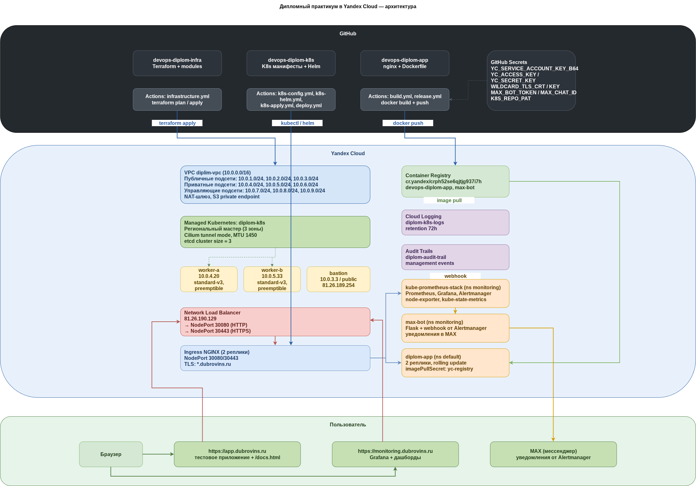
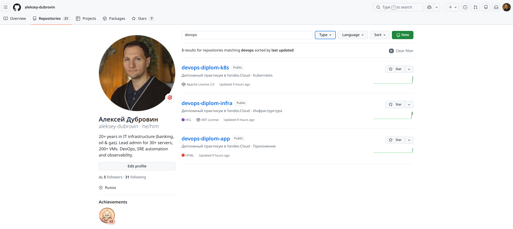

# Введение

## Актуальность работы

Современная разработка программного обеспечения немыслима без
автоматизации процессов сборки, доставки и эксплуатации приложений.
DevOps-инженер должен уметь не только написать конфигурацию для
развёртывания инфраструктуры, но и выстроить полный цикл: от коммита
в репозиторий до работающего приложения в продакшене, включая
мониторинг, алертинг, аудит действий и управление секретами.

В рамках дипломной работы я реализовал полноценный DevOps-проект на
базе облачной платформы Yandex Cloud. Проект объединяет три независимых
слоя: инфраструктуру как код, Kubernetes-кластер с внешними worker-узлами
и приложение с настроенным CI/CD. Каждый слой управляется через Git, изменения
проходят ревью, а развёртывание полностью автоматизировано.

## Цель работы

Разработать, развернуть и продемонстрировать работу полного
DevOps-стека в облаке Yandex Cloud, включающего:

- инфраструктуру, описанную в Terraform с модульной архитектурой;
- Kubernetes-кластер в гибридной конфигурации (управляемый мастер
  и внешние worker-узлы);
- тестовое приложение с автоматической сборкой и деплоем;
- систему мониторинга и алертинга;
- аудит действий и централизованное логирование;
- интеграцию с мессенджером MAX для уведомлений.

## Задачи

1. Подготовить облачную инфраструктуру через Terraform: VPC, подсети,
   сервисные аккаунты, Container Registry, Audit Trails, Logging Group.
2. Развернуть Managed Kubernetes с региональным мастером в туннельном
   режиме Cilium, подключить внешние worker-узлы на прерываемых ВМ.
3. Настроить Bastion-хост, Network Load Balancer и Ingress NGINX для
   публикации сервисов.
4. Подготовить тестовое приложение на nginx, собрать Docker-образ и
   опубликовать его в Yandex Container Registry.
5. Развернуть систему мониторинга на базе kube-prometheus-stack:
   Prometheus, Grafana, Alertmanager, node-exporter, kube-state-metrics.
6. Настроить Alertmanager для отправки уведомлений в MAX Bot.
7. Построить CI/CD в GitHub Actions для инфраструктуры и приложения.
8. Обеспечить безопасность: секреты хранятся в GitHub Secrets,
   TLS-сертификаты — в Yandex Certificate Manager, доступ — через
   security groups и bastion.
9. Настроить Audit Trails и Logging Group для наблюдаемости облачных
   ресурсов.

## Использованные технологии

| Категория | Технологии |
|-----------|-----------|
| Облако | Yandex Cloud |
| IaC | Terraform, модули, S3 backend |
| Оркестрация | Managed Kubernetes, Cilium, Kubespray |
| Контейнеры | Docker, Yandex Container Registry |
| Мониторинг | Prometheus, Grafana, Alertmanager |
| CI/CD | GitHub Actions |
| Ingress | NGINX Ingress Controller, Network Load Balancer |
| TLS | Yandex Certificate Manager, wildcard-сертификат |
| Уведомления | MAX Bot (собственный образ) |
| Аудит | Audit Trails, Cloud Logging |

## Структура работы

- **Глава 1** — подготовка облачной инфраструктуры: VPC, подсети,
  Terraform-модули, backend, Audit Trails и Logging Group.
- **Глава 2** — Kubernetes-кластер: Managed K8s, Cilium, внешние узлы,
  Bastion, Ingress.
- **Глава 3** — тестовое приложение и Yandex Container Registry.
- **Глава 4** — мониторинг и алертинг: Prometheus, Grafana, MAX Bot.
- **Глава 5** — CI/CD: три независимых пайплайна в GitHub Actions.
- **Глава 6** — эксплуатация и обслуживание: работа с прерываемыми ВМ,
  обновления, просмотр логов и аудита.

**Общая схема проекта:**

## Репозитории проекта

- `devops-diplom-infra` — инфраструктура (Terraform)
- `devops-diplom-k8s` — конфигурация Kubernetes и Helm
- `devops-diplom-app` — тестовое приложение и CI/CD

**Репозиторий на GitHub:**

