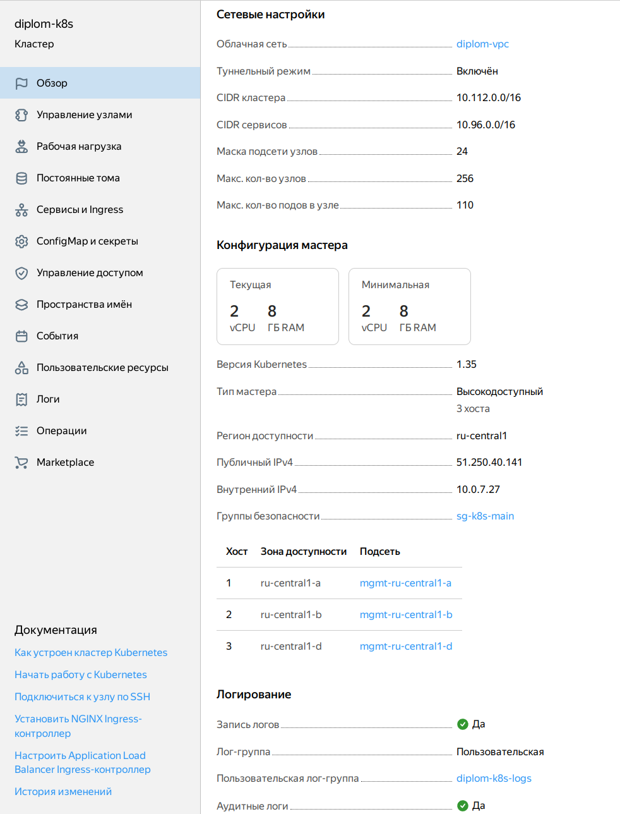
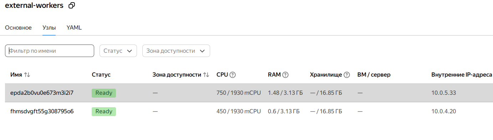
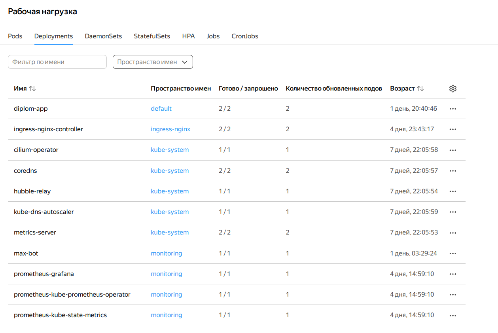
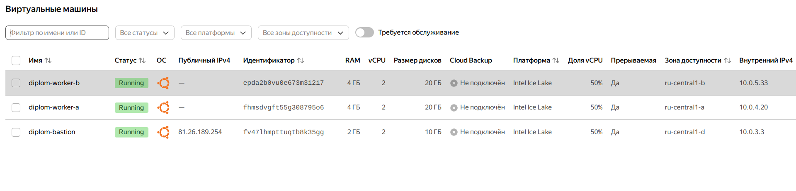
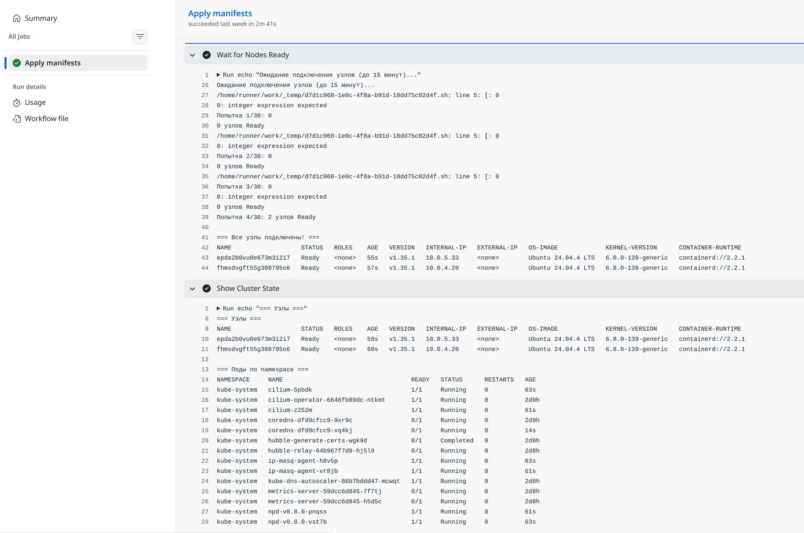
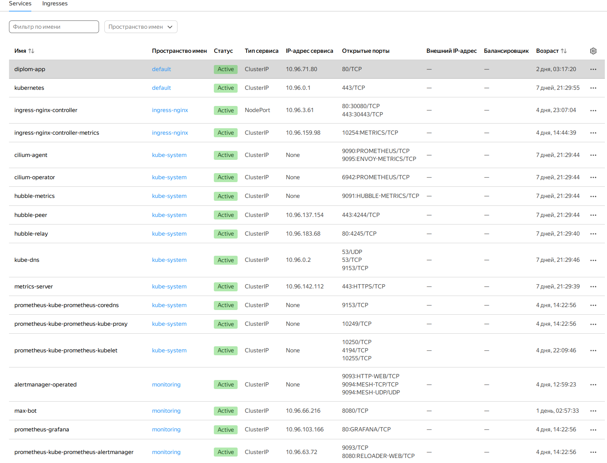
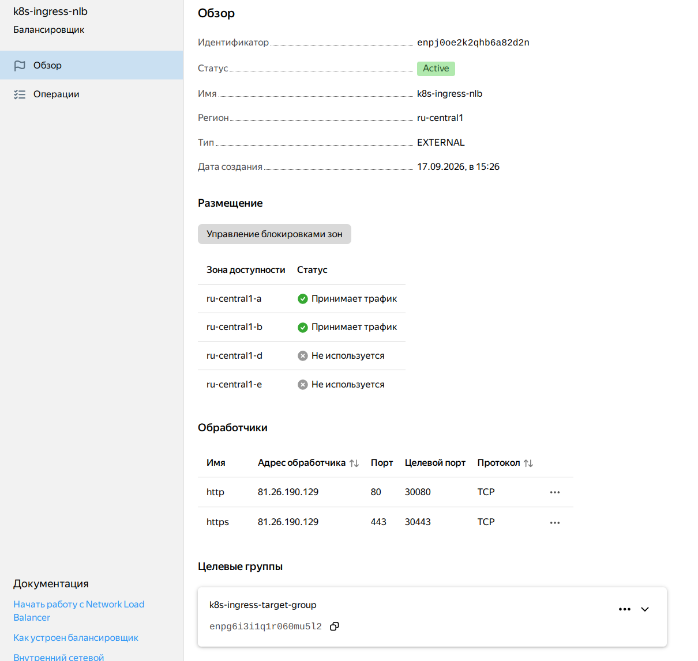
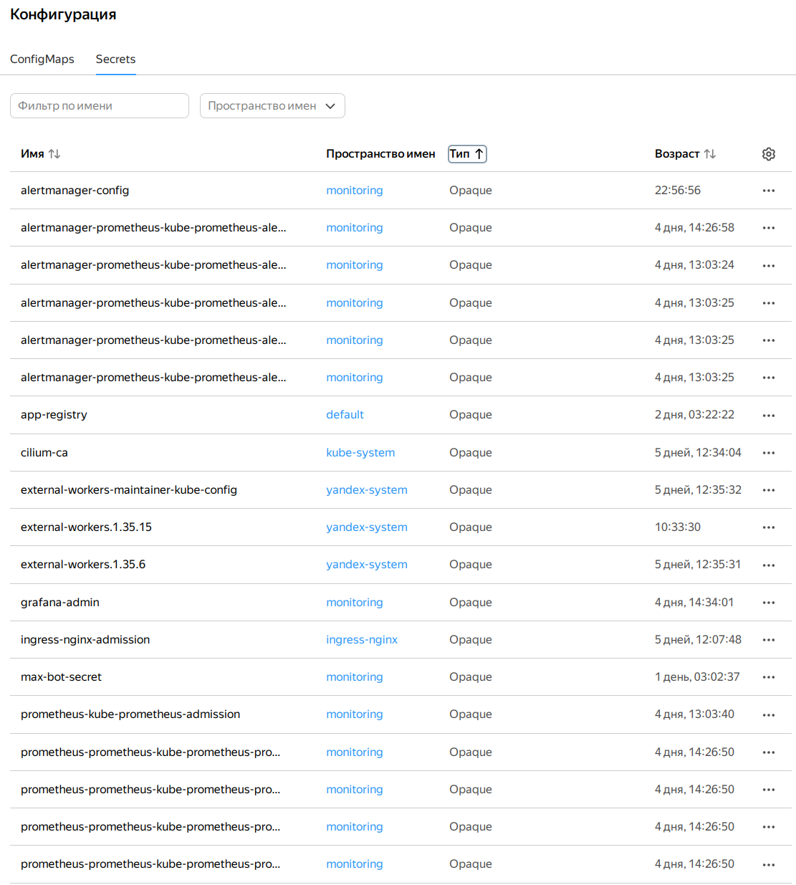

# Глава 2. Kubernetes кластер

## 2.1 Выбор варианта развёртывания

Задание диплома предлагает два варианта создания кластера:

1. Самостоятельная установка на ВМ через Kubespray или вручную.
2. Использование Yandex Managed Service for Kubernetes.

Я выбрал **гибридный подход**: управляемый мастер от Yandex Cloud
и собственные worker-узлы, подключённые как external nodes. Причины:

- Managed мастер избавляет от необходимости самостоятельно обслуживать
  control plane, обновлять etcd, следить за сертификатами.
- Внешние worker-узлы дают полный контроль над конфигурацией серверов
  и позволяют использовать прерываемые ВМ для экономии бюджета.
- Это более сложный, но и более показательный сценарий для дипломной
  работы: я продемонстрировал, что умею работать с гибридной
  инфраструктурой.

**Консоль Managed Kubernetes:**



## 2.2 Региональный мастер

Кластер создан как **региональный**: три мастер-узла автоматически
размещаются в трёх зонах доступности. Это отказоустойчивая схема:
выход из строя одной зоны не приводит к потере API-сервера.

В Terraform-модуле `k8s-cluster` мастер описан так:

```hcl
resource "yandex_kubernetes_cluster" "this" {
  name        = var.cluster_name
  network_id  = var.network_id

  master {
    version            = var.cluster_version
    public_ip          = var.public_access
    security_group_ids = var.security_group_ids
    etcd_cluster_size  = 3

    dynamic "master_location" {
      for_each = var.master_locations
      content {
        zone      = master_location.value.zone
        subnet_id = master_location.value.subnet_id
      }
    }
  }
}
```

Мастер размещён в управляющих подсетях `10.0.7.0/24`, `10.0.8.0/24`,
`10.0.9.0/24` — по одной в каждой зоне.

**Консоль Managed Kubernetes workers:**



## 2.3 Туннельный режим Cilium

По умолчанию Managed Kubernetes использует сетевой плагин Calico.
Для подключения внешних узлов я включил **туннельный режим Cilium**:

```hcl
network_provider {
  type = "cilium"
}
```

Cilium в туннельном режиме инкапсулирует трафик между подами через
VXLAN-туннель (порт 8472/UDP). Это критично для нашего сценария: узлы
находятся на разных физических хостах, а Cilium обеспечивает им
прозрачную сетевую связность, включая трафик между внешними узлами
и управляемыми компонентами кластера.

**Дополнительно пришлось решить проблему с MTU.** По умолчанию
cilium_host получает MTU 1500 (как и физический интерфейс узла), но
VXLAN-инкапсуляция добавляет 50 байт служебных данных. Из-за этого
крупные пакеты между подами на разных узлах терялись. Я исправил
это через `cilium-config` ConfigMap, установив MTU = 1450. После
перезапуска Cilium поды на разных узлах начали общаться без потерь.

**Консоль рабочей нагрузки:**



## 2.4 Подключение внешних worker-узлов

Внешние узлы подключаются к Managed Kubernetes через специальный
механизм — CustomResource `NodeGroup` из API `mks.yandex.cloud/v1alpha1`.
Кластер сам заходит по SSH на указанные ВМ и устанавливает все
необходимые компоненты: containerd, kubelet, kube-proxy, cilium-agent.

### Схема подключения

1. Создание двух worker-ВМ через Terraform (в зонах `ru-central1-a`
   и `ru-central1-b`).
2. Генерация манифеста `NodeGroup` с их IP-адресами.
3. Создание SSH-секрета в кластере для доступа к узлам.
4. Применение манифеста — кластер сам подключает узлы.

### Создание ВМ

В модуле `compute` worker-узлы описаны с учётом требований:
- Тип `standard-v3`, 2 vCPU, 4 GB RAM, core_fraction = 50%.
- Прерываемые (`preemptible = true`).
- В приватных подсетях, без публичного IP.
- С security group `sg-k8s-workers`.

```hcl
resource "yandex_compute_instance" "worker" {
  for_each = var.worker_config.zones

  name        = "${var.worker_config.name_prefix}-${each.key}"
  platform_id = var.worker_config.platform_id
  zone        = each.value

  resources {
    cores         = var.worker_config.cores
    memory        = var.worker_config.memory
    core_fraction = var.worker_config.core_fraction
  }

  network_interface {
    subnet_id          = var.private_subnet_ids[each.value]
    nat                = false
    security_group_ids = [var.security_group_ids["sg-k8s-workers"]]
  }

  scheduling_policy {
    preemptible = var.worker_config.preemptible
  }
}
```

**Консоль Compute Cloud:**



### Генерация манифеста NodeGroup

Манифест генерируется автоматически через шаблон `nodegroup.yaml.tpl`
и ресурс `local_file`:

```hcl
resource "local_file" "nodegroup_manifest" {
  content  = local.nodegroup_manifest
  filename = "${path.module}/k8s-nodes/nodegroup.yaml"
}

locals {
  nodegroup_manifest = templatefile("${path.module}/templates/nodegroup.yaml.tpl", {
    nodegroup_name  = var.external_nodegroup_name
    namespace       = "yandex-system"
    ssh_secret_name = "external-node-ssh-key"
    worker_ips      = module.compute.worker_internal_ips_list
  })
}
```

Шаблон:

```yaml
apiVersion: mks.yandex.cloud/v1alpha1
kind: NodeGroup
metadata:
  name: ${nodegroup_name}
  namespace: ${namespace}
spec:
  ips:
%{ for ip in worker_ips ~}
    - ${ip}
%{ endfor ~}
  provisionBySsh:
    sshKeySecret:
      name: ${ssh_secret_name}
      namespace: ${namespace}
```

### Применение манифеста

Манифест применяется через отдельный workflow `k8s-apply.yml`.
Он создаёт SSH-секрет в namespace `yandex-system` и применяет
`NodeGroup`. Кластер заходит на каждый узел по SSH, устанавливает
компоненты и регистрирует узлы.

**Консоль github с workflow external nodes:**



## 2.5 Bastion-хост

Для управления приватными узлами я развернул Bastion-хост — небольшую
публичную ВМ, через которую идёт SSH-доступ ко всем внутренним
ресурсам.

Bastion создан в публичной подсети `ru-central1-d`, security group
`sg-bastion` разрешает SSH (22) и ICMP из интернета. На bastion
установлен только `openssh-server` и базовые утилиты.

Для удобства работы я настроил `~/.ssh/config`:

```
Host diplom-bastion
    HostName 81.26.189.254
    User ubuntu
    IdentityFile ~/.ssh/aleksey
    IdentitiesOnly yes

Host diplom-worker-a
    HostName 10.0.4.20
    User ubuntu
    IdentityFile ~/.ssh/aleksey
    IdentitiesOnly yes
    ProxyJump diplom-bastion

Host diplom-worker-b
    HostName 10.0.5.33
    User ubuntu
    IdentityFile ~/.ssh/aleksey
    IdentitiesOnly yes
    ProxyJump diplom-bastion
```

Это позволяет подключаться к worker-узлам одной командой
`ssh diplom-worker-a`, при этом трафик автоматически идёт через bastion.

## 2.6 Network Load Balancer и Ingress NGINX

Для публикации сервисов я использовал два компонента:

1. **Network Load Balancer (NLB)** — транспортный балансировщик
   от Yandex Cloud. Создан через Terraform, направляет трафик с
   публичного IP на NodePort worker-узлов.

2. **Ingress NGINX** — L7-балансировщик внутри кластера. Установлен
   через Helm, обслуживает Ingress-ресурсы и терминацию TLS.

### NLB

Создан вручную через Terraform, потому что CCM (Cloud Controller
Manager) не умеет автоматически включать external nodes в target
groups. NLB направляет трафик на NodePort 30080 (HTTP) и 30443 (HTTPS):

```hcl
resource "yandex_lb_network_load_balancer" "k8s_ingress" {
  name = "k8s-ingress-nlb"
  type = "external"

  listener {
    name        = "http"
    port        = 80
    target_port = 30080
    external_address_spec {
      ip_version = "ipv4"
    }
  }

  listener {
    name        = "https"
    port        = 443
    target_port = 30443
    external_address_spec {
      ip_version = "ipv4"
    }
  }

  attached_target_group {
    target_group_id = yandex_lb_target_group.k8s_ingress.id

    healthcheck {
      name = "http"
      http_options {
        port = 30080
        path = "/healthz"
      }
    }
  }
}
```

### Ingress NGINX

Установлен через Helm с values-файлом `helm/ingress-nginx-values.yaml`:

```yaml
controller:
  admissionWebhooks:
    enabled: false
  service:
    type: NodePort
    externalTrafficPolicy: Cluster
    nodePorts:
      http: 30080
      https: 30443
  replicaCount: 2
  resources:
    requests:
      cpu: 100m
      memory: 128Mi
    limits:
      cpu: 500m
      memory: 512Mi
```

Важные детали:

- `admissionWebhooks.enabled = false` — отключено из-за особенности
  Cilium tunnelled mode: мастер не может достучаться до webhook-пода,
  и любой `kubectl apply` падал с ошибкой 401.
- `type: NodePort` с фиксированными портами 30080/30443 — эти же порты
  указаны в NLB.
- `externalTrafficPolicy: Cluster` — в отличие от `Local`, работает
  без healthCheckNodePort, что упрощает SG.

**Консоль Kubernetes services:**



**Консоль Балансировщики:**



## 2.7 Хранение секретов кластера

Все секреты (пароль Grafana, TLS-сертификат, токены для MAX Bot,
imagePullSecret для реестра) описаны в реестре
`config/secrets/registry.yaml`. Workflow `k8s-config.yml` читает
реестр и создаёт Secret-объекты в кластере.

Такой data-driven подход дал:

- Единое место для описания всех Secret'ов.
- Автоматическое создание и обновление при push в main.
- Отсутствие хардкода — все значения берутся из GitHub Secrets.

Пример реестра:

```yaml
secrets:
  - name: wildcard-dubrovins-tls
    namespace: monitoring
    type: kubernetes.io/tls
    keys:
      - name: tls.crt
        fromEnv: WILDCARD_TLS_CRT
      - name: tls.key
        fromEnv: WILDCARD_TLS_KEY

  - name: yc-registry
    namespace: default
    type: docker-registry
    server: cr.yandex
    username: json_key
    passwordFromEnv: YC_SA_KEY_JSON
```

**Консоль Kubernetes secrets:**



## 2.8 Итоги главы

В результате развёрнут гибридный Kubernetes-кластер:

- управляемый региональный мастер в трёх зонах;
- два внешних worker-узла на прерываемых ВМ;
- туннельный режим Cilium с корректным MTU;
- Bastion-хост для SSH-доступа;
- NLB с фиксированными портами и Ingress NGINX;
- централизованное управление секретами через реестр.

Кластер готов к развёртыванию приложения, мониторинга и CI/CD.