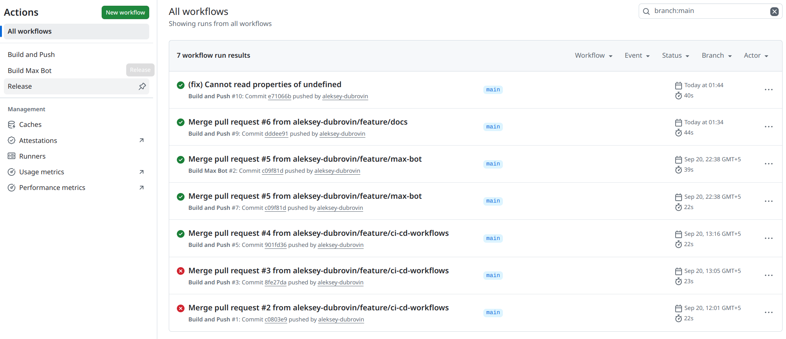
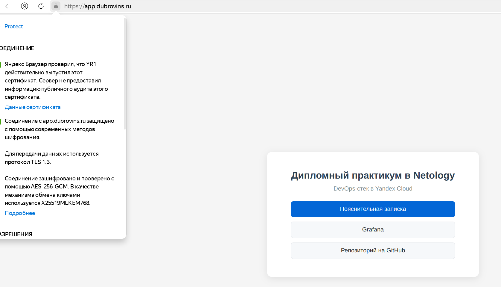
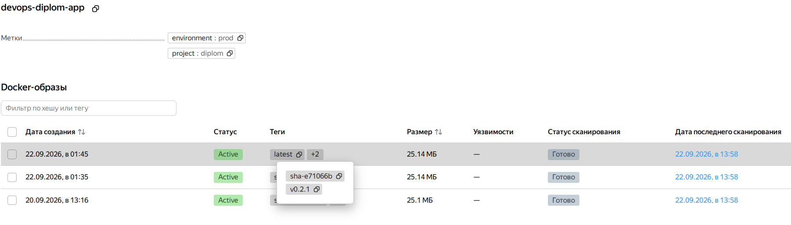
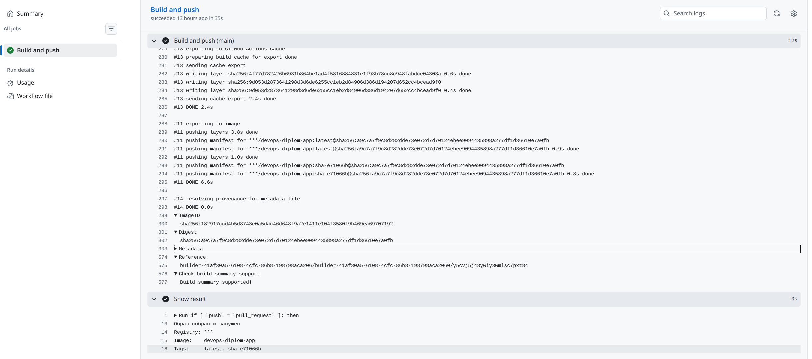
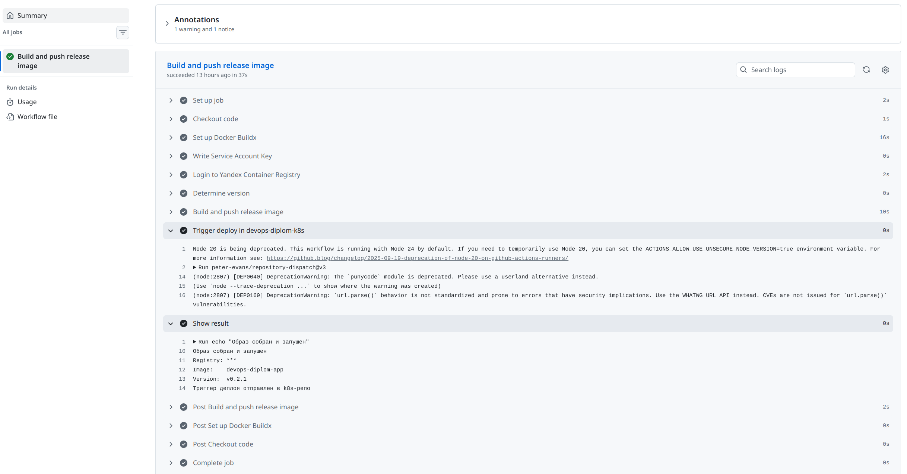
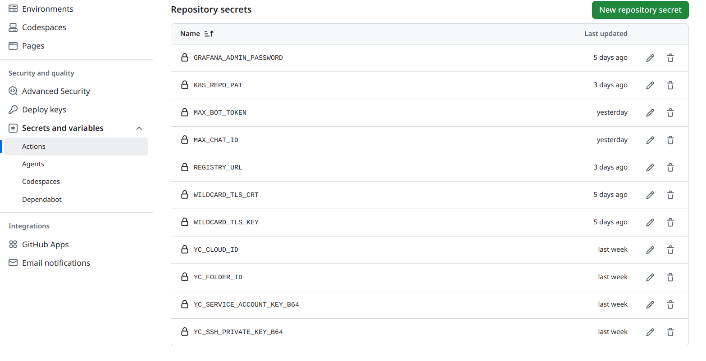

# Глава 3. Тестовое приложение

## 3.1 Назначение и структура

Для демонстрации полного CI/CD-цикла я подготовил тестовое приложение —
статический сайт на nginx. Оно эмулирует основное приложение компании:
достаточно сложное, чтобы показать сборку Docker-образа, но при этом
не отвлекающее от инфраструктурной части.

Приложение размещено в отдельном репозитории `devops-diplom-app`.
Структура:

```text
devops-diplom-app/
├── app/
│   ├── Dockerfile
│   └── index.html
├── .github/
│   └── workflows/
│       ├── build.yml           # сборка образа при push в main
│       └── release.yml         # сборка + деплой при создании тега
├── docs/                       # пояснительная записка
├── .gitignore
└── README.md
```

Вынесение приложения в отдельный репозиторий — осознанное решение.
У инфраструктуры, манифестов Kubernetes и кода приложения разные
жизненные циклы: инфраструктура меняется редко, манифесты — иногда,
код — постоянно. Разделение даёт чистую историю и правильные триггеры
для CI/CD.

**Консоль github workflows app:**



## 3.2 Статическая страница

Файл `app/index.html` — простая HTML-страница с минимальным CSS.
Заголовок: «Дипломный практикум в Netology». Страница отдаётся
nginx без дополнительной логики.

```html
<!DOCTYPE html>
<html lang="ru">
<head>
  <meta charset="UTF-8">
  <title>Дипломный практикум в Netology</title>
  <style>
    body {
      font-family: sans-serif;
      background: #f5f5f5;
      display: flex;
      justify-content: center;
      align-items: center;
      height: 100vh;
      margin: 0;
    }
    .card {
      background: white;
      padding: 40px 60px;
      border-radius: 12px;
      box-shadow: 0 4px 20px rgba(0,0,0,0.1);
      text-align: center;
    }
  </style>
</head>
<body>
  <div class="card">
    <h1>Дипломный практикум в Netology</h1>
    <p>Версия: latest</p>
  </div>
</body>
</html>
```

**Отображение приложения в браузере:**



## 3.3 Dockerfile

Для сборки образа я использовал минималистичный подход: базовый
образ `nginx:alpine` и копирование статики.

```dockerfile
FROM nginx:alpine

COPY index.html /usr/share/nginx/html/index.html

EXPOSE 80

HEALTHCHECK --interval=30s --timeout=3s --retries=3 \
  CMD wget --quiet --tries=1 --spider http://localhost/ || exit 1
```

Почему именно так:

- **`nginx:alpine`** — минимальный размер образа (около 25 MB
  в сжатом виде), что ускоряет загрузку на worker-узлы.
- **Копирование только `index.html`** — не тащим ничего лишнего.
- **`HEALTHCHECK`** — хотя в Kubernetes используются свои probes,
  healthcheck полезен при локальном запуске через `docker run`.

## 3.4 Локальная проверка

Перед публикацией образа в реестр я проверил его локально:

```bash
cd app
docker build -t diplom-app:test .
docker run --rm -p 8080:80 diplom-app:test
```

Открыл `http://localhost:8080` и убедился, что страница отображается
корректно. Это базовая гигиена: не публиковать в реестр непроверенный
образ.

## 3.5 Yandex Container Registry

Хранилище Docker-образов я создал через Terraform в репозитории
`devops-diplom-infra`:

```hcl
resource "yandex_container_registry" "diplom" {
  name      = "diplom-registry"
  folder_id = var.folder_id

  labels = {
    project     = "diplom"
    environment = "prod"
  }
}
```

Сервисному аккаунту `avdubrovin-prod` назначены роли:
- `container-registry.images.pusher` — для загрузки образов
  из GitHub Actions.
- `container-registry.images.puller` — для скачивания образов
  worker-узлами.

Адрес реестра: `cr.yandex/crph52se6qjtjg937i7h`.

**Версии приложения devops-diplom-app:**



## 3.6 Публикация образа вручную

На начальном этапе я опубликовал первый образ вручную, чтобы убедиться,
что вся цепочка работает:

```bash
# Авторизация в реестре
yc container registry configure-docker

# Сборка и push
docker build -t cr.yandex/crph52se6qjtjg937i7h/devops-diplom-app:v0.1.0 ./app
docker push cr.yandex/crph52se6qjtjg937i7h/devops-diplom-app:v0.1.0
```

После этого образ появился в реестре, и я смог приступить к настройке
автоматической сборки через GitHub Actions.

## 3.7 Автоматическая сборка через GitHub Actions

Два workflow в репозитории приложения автоматизируют сборку:

### build.yml

Триггер — push в `main`. Workflow собирает образ с тегами `latest`
и `sha-<short-commit>` и пушит его в реестр.

```yaml
- name: Build and push
  uses: docker/build-push-action@v6
  with:
    context: ./app
    push: true
    provenance: false
    sbom: false
    tags: |
      ${{ secrets.REGISTRY_URL }}/${{ env.IMAGE_NAME }}:latest
      ${{ secrets.REGISTRY_URL }}/${{ env.IMAGE_NAME }}:sha-${{ steps.vars.outputs.sha_short }}
```

Важные детали:

- **`provenance: false`, `sbom: false`** — обязательные параметры
  при работе с Yandex Container Registry. По умолчанию `docker/buildx`
  добавляет в манифест образа attestation-данные (provenance и SBOM),
  которые Yandex Registry не умеет читать. Push падал с ошибкой
  `Cannot read manifest data`. После отключения этих параметров
  манифест стал стандартным v2.
- **`sha-<commit>`** — помимо `latest`, каждый образ получает уникальный
  тег на основе коммита. Это позволяет при необходимости откатиться
  к конкретной версии.

**Консоль github workflow build and push:**



### release.yml

Триггер — создание тега `v*`. Workflow собирает образ с тегом версии
(например, `v1.0.0` и `latest`) и отправляет `repository_dispatch`
в репозиторий `devops-diplom-k8s`, который затем деплоит приложение.

```yaml
- name: Determine version
  id: version
  run: |
    if [ "${{ github.event_name }}" = "push" ]; then
      VERSION="${{ github.ref_name }}"
    else
      VERSION="${{ github.event.inputs.tag }}"
    fi
    echo "version=$VERSION" >> $GITHUB_OUTPUT

- name: Build and push release image
  uses: docker/build-push-action@v6
  with:
    context: ./app
    push: true
    provenance: false
    sbom: false
    tags: |
      ${{ secrets.REGISTRY_URL }}/${{ env.IMAGE_NAME }}:${{ steps.version.outputs.version }}
      ${{ secrets.REGISTRY_URL }}/${{ env.IMAGE_NAME }}:latest

- name: Trigger deploy in devops-diplom-k8s
  uses: peter-evans/repository-dispatch@v3
  with:
    token: ${{ secrets.K8S_REPO_PAT }}
    repository: aleksey-dubrovin/devops-diplom-k8s
    event-type: release-published
    client-payload: |
      {
        "version": "${{ steps.version.outputs.version }}"
      }
```

**Консоль github workflow release:**



## 3.8 Секреты CI/CD приложения

В настройках репозитория `devops-diplom-app` я добавил:

| Секрет | Назначение |
|--------|-----------|
| `YC_SERVICE_ACCOUNT_KEY_B64` | JSON-ключ сервисного аккаунта в base64 |
| `REGISTRY_URL` | `cr.yandex/crph52se6qjtjg937i7h` |
| `K8S_REPO_PAT` | PAT для отправки `repository_dispatch` в k8s-репо |

GitHub автоматически маскирует эти значения в логах, поэтому в
выводе workflow вместо реальных данных появляются `***`.

**Консоль github secrets:**



## 3.9 Итоги главы

- Создан отдельный репозиторий для приложения с чистой структурой.
- Подготовлен минималистичный Dockerfile на `nginx:alpine`.
- Создан Yandex Container Registry через Terraform.
- Настроены два workflow: сборка образа при push и релиз с тегом.
- Решена проблема с manifest-форматом Yandex Registry.
- Настроен автоматический триггер деплоя в k8s-репозиторий.
