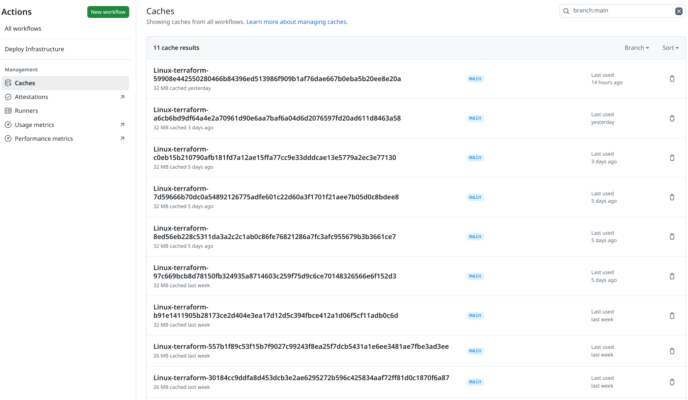
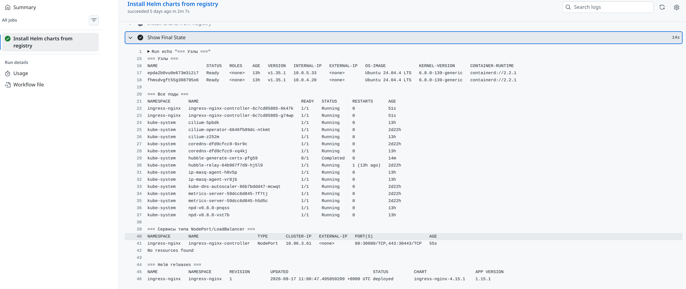
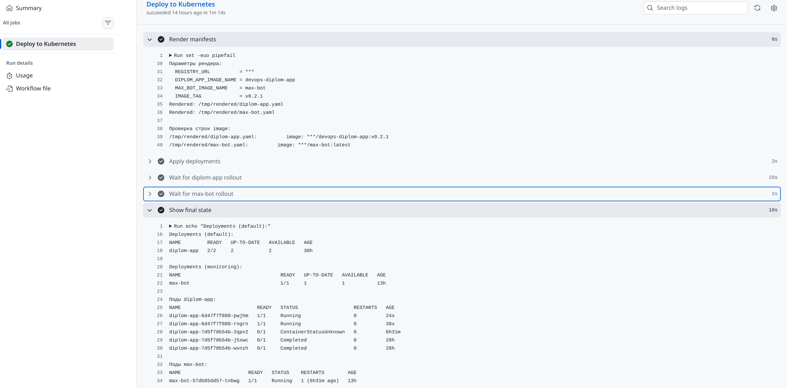

# Глава 5. CI/CD

## 5.1 Общая архитектура CI/CD

В проекте используются три независимых пайплайна, каждый из которых
отвечает за свой слой инфраструктуры:

| Слой | Репозиторий | Workflow | Триггер |
|------|-------------|----------|---------|
| Инфраструктура | `devops-diplom-infra` | `infrastructure.yml` | push в main (папка `infrastructure/`) |
| K8s конфигурация | `devops-diplom-k8s` | `k8s-config.yml`, `k8s-apply.yml`, `k8s-helm.yml`, `deploy.yml` | push в main (разные папки) |
| Приложение | `devops-diplom-app` | `build.yml`, `release.yml` | push в main / создание тега |

Такое разделение даёт:

- **Независимые жизненные циклы.** Инфраструктура меняется редко,
  приложение — постоянно. Не нужно пересобирать кластер из-за
  новой версии приложения.
- **Изоляцию секретов.** Ключи от кластера хранятся только в
  k8s-репозитории, ключи от registry — в обоих, где нужно.
- **Быстрые пайплайны.** Каждый workflow срабатывает только на
  изменения в своей папке, не блокируя другие.

**Место для скриншота 45:** общая схема пайплайнов. Три блока
(infra → k8s → app) с указанием, что где запускается.

## 5.2 CI/CD для инфраструктуры

### 5.2.1 Workflow infrastructure.yml

Триггеры:

```yaml
on:
  push:
    branches: [main]
    paths:
      - 'infrastructure/**'
  pull_request:
    branches: [main]
    paths:
      - 'infrastructure/**'
  workflow_dispatch:
```

Workflow срабатывает только при изменениях в папке `infrastructure/`,
чтобы не запускаться при правках README или `.gitignore`.

### 5.2.2 Шаги workflow

1. **Checkout кода.**
2. **Кэш утилит** (YC CLI, Terraform).
3. **Запись JSON-ключа SA** из `YC_SERVICE_ACCOUNT_KEY_B64`.
4. **Terraform init** с S3 backend:

```bash
terraform init \
  -backend-config="access_key=$TF_VAR_access_key" \
  -backend-config="secret_key=$TF_VAR_secret_key"
```

5. **Terraform plan** — сохраняется как artifact.
6. **Terraform apply** — только при push в main.

### 5.2.3 Разделение plan и apply

Для PR выполняется только `plan` — это позволяет увидеть изменения
до мержа. Для push в main выполняется `plan` и затем `apply`.
Такой подход предотвращает случайные изменения прода от PR.

```yaml
- name: Terraform Plan (PR)
  if: github.event_name == 'pull_request'
  run: terraform plan

- name: Terraform Apply (main)
  if: github.event_name == 'push' && github.ref == 'refs/heads/main'
  run: terraform apply -auto-approve
```

### 5.2.4 Кэширование

Кэш для Terraform-провайдеров и YC CLI:

```yaml
- name: Cache Terraform plugins
  uses: actions/cache@v4
  with:
    path: infrastructure/.terraform
    key: ${{ runner.os }}-terraform-${{ hashFiles('infrastructure/**/*.tf') }}
```

Это ускорило запуски с 3–4 минут до 1–1.5 минут. Особенно важно
для итеративной разработки, когда workflow запускается часто.

**Консоль github workflow caches:**



## 5.3 CI/CD для K8s конфигурации

В репозитории `devops-diplom-k8s` четыре workflow, каждый
отвечает за свой тип ресурсов:

### 5.3.1 k8s-config.yml

Отвечает за:

- Создание Secret-объектов из реестра `config/secrets/registry.yaml`.
- Создание Secret `alertmanager-config` из файла
  `monitoring/alertmanager.yaml`.
- Применение Service и Ingress из `config/service/` и `config/ingress/`.
- Перезапуск Grafana при обновлении её Secret.

Триггеры: push в main при изменениях в `config/**` или `monitoring/**`.

**Data-driven подход к секретам.** Вместо того чтобы для каждого
Secret'а писать отдельный `kubectl create`, я описал реестр:

```yaml
secrets:
  - name: wildcard-dubrovins-tls
    namespace: monitoring
    type: kubernetes.io/tls
    keys:
      - name: tls.crt
        fromEnv: WILDCARD_TLS_CRT
      - name: tls.key
        fromEnv: WILDCARD_TLS_KEY

  - name: yc-registry
    namespace: default
    type: docker-registry
    server: cr.yandex
    username: json_key
    passwordFromEnv: YC_SA_KEY_JSON
```

Workflow читает реестр и для каждого Secret'а вызывает нужную команду
(`kubectl create secret generic` или `kubectl create secret docker-registry`).
Все значения берутся из GitHub Secrets через переменные окружения
с префиксом `SECRET_`.

### 5.3.2 k8s-apply.yml

Отвечает за подключение внешних worker-узлов:

- Создание SSH-секрета `external-node-ssh-key` из
  `YC_SSH_PRIVATE_KEY_B64`.
- Применение `NodeGroup` манифеста.
- Ожидание готовности узлов.

Триггер: push в main при изменениях в `external-nodes/**`.

### 5.3.3 k8s-helm.yml

Универсальный workflow для Helm-чартов. Читает реестр
`helm/charts.yaml` и устанавливает все указанные чарты:

```yaml
charts:
  - release: ingress-nginx
    repoName: ingress-nginx
    repo: https://kubernetes.github.io/ingress-nginx
    chart: ingress-nginx/ingress-nginx
    namespace: ingress-nginx
    valuesFile: helm/ingress-nginx-values.yaml
    timeout: 15m
    enabled: true

  - release: prometheus
    repoName: prometheus-community
    repo: https://prometheus-community.github.io/helm-charts
    chart: prometheus-community/kube-prometheus-stack
    namespace: monitoring
    valuesFile: helm/monitoring-values.yaml
    timeout: 30m
    enabled: true
```

Такой подход позволяет добавить новый чарт, добавив одну запись
в реестр. Workflow сам подтянет нужный репозиторий, обновит
release и подождёт готовности.

Особенности:

- **Cleanup pending-релизов.** Перед `helm upgrade` workflow
  проверяет статус релиза. Если он в `pending-*` (завис при
  предыдущей установке), релиз удаляется и устанавливается
  заново. Это устраняет классическую проблему «another operation
  in progress».
- **`--atomic`** — при ошибке Helm откатывает релиз. Это
  предотвращает частично установленные системы.
- **Кэш Helm-репозиториев** — ускоряет повторные запуски.

**Консоль github workflow k8s-helm:**



### 5.3.4 deploy.yml

Отдельный workflow для деплоя приложения. Триггерится через
`repository_dispatch` из `devops-diplom-app` при создании тега
или через `workflow_dispatch`.

Ключевая особенность — **envsubst**. Файлы в `config/app/` содержат
плейсхолдеры вида `${REGISTRY_URL}`, `${DIPLOM_APP_IMAGE_NAME}`,
`${IMAGE_TAG}`. Workflow рендерит их перед применением:

```yaml
- name: Render manifests
  run: |
    export REGISTRY_URL="${{ steps.registry.outputs.registry_url }}"
    export DIPLOM_APP_IMAGE_NAME="${{ steps.registry.outputs.diplom_app_image_name }}"
    export MAX_BOT_IMAGE_NAME="${{ steps.registry.outputs.max_bot_image_name }}"
    export IMAGE_TAG="${{ env.VERSION }}"

    for FILE in config/app/*.yaml; do
      OUT="/tmp/rendered/$(basename $FILE)"
      envsubst < "$FILE" > "$OUT"
    done
```

Это позволяет:

- Не хардкодить URL реестра в манифестах.
- Использовать одну версию манифеста для всех окружений.
- Управлять значениями через Secret `app-registry` в кластере.

Далее workflow применяет отрендеренные файлы и ждёт rollout обоих
Deployment'ов: `diplom-app` и `max-bot`.

**Успешный запуск `Deploy App`:**



## 5.4 CI/CD для приложения

В репозитории `devops-diplom-app` два workflow.

### 5.4.1 build.yml

Триггер — push в main. Собирает образ с двумя тегами (`latest` и
`sha-<commit>`) и пушит в Yandex Container Registry.

Особенности:

- **`provenance: false` и `sbom: false`** — обязательные параметры
  для совместимости с Yandex Registry (описано в главе 3).
- **Логин через `--password-stdin`** — правильный способ передачи
  JSON-ключа в `docker login`:

```yaml
- name: Write Service Account Key
  run: |
    echo '${{ secrets.YC_SERVICE_ACCOUNT_KEY_B64 }}' | base64 -d > sa-key.json

- name: Login to Yandex Container Registry
  run: |
    cat sa-key.json | docker login cr.yandex --username json_key --password-stdin
```

- **Кэш слоёв Docker** — ускоряет сборку:

```yaml
cache-from: type=gha
cache-to: type=gha,mode=max
```

### 5.4.2 release.yml

Триггер — создание тега `v*`. Отличие от `build.yml`:

1. Собирает образ с тегом версии (например, `v1.0.0`).
2. Пушит образ в реестр.
3. Отправляет `repository_dispatch` в `devops-diplom-k8s`.

```yaml
- name: Trigger deploy in devops-diplom-k8s
  uses: peter-evans/repository-dispatch@v3
  with:
    token: ${{ secrets.K8S_REPO_PAT }}
    repository: aleksey-dubrovin/devops-diplom-k8s
    event-type: release-published
    client-payload: |
      {
        "version": "${{ steps.version.outputs.version }}"
      }
```

Это ключевая часть сквозного сценария: создание тега автоматически
запускает деплой в кластер.

## 5.5 Сквозной сценарий: от коммита до продакшена

Рассмотрим полный путь изменения в коде приложения.

1. **Разработчик** вносит изменение в `app/index.html` и коммитит
   в feature-ветку.
2. **Открывается PR.** Запускается `Build and Push` в режиме
   «только проверка»: образ собирается, но не публикуется.
3. **Ревью и мерж в main.** При мерже `build.yml` собирает образ
   с тегами `latest` и `sha-<commit>` и пушит в реестр.
4. **Создание тега `v0.2.0`.** Запускается `release.yml`:
   - Собирает образ с тегом `v0.2.0` и `latest`.
   - Пушит в реестр.
   - Отправляет `repository_dispatch` в k8s-репо.
5. **k8s-репо получает событие.** Запускается `deploy.yml`:
   - Читает `REGISTRY_URL` и имена образов из Secret `app-registry`.
   - Рендерит `config/app/diplom-app.yaml` через envsubst
     с `IMAGE_TAG=v0.2.0`.
   - Применяет Deployment и Service.
   - Ждёт завершения rollout.
6. **Приложение обновлено.** Новый образ скачивается на worker-узлы
   через `imagePullSecret`, поды пересоздаются, `https://app.dubrovins.ru`
   отдаёт новую версию.

Весь путь от коммита до продакшена занимает 5–7 минут и не требует
ручных действий.

## 5.6 Разделение секретов

В проекте используется три уровня секретов:

| Уровень | Что хранится | Где |
|---------|--------------|-----|
| GitHub Secrets | JSON-ключи SA, токены, TLS-сертификаты | Настройки репозитория |
| Kubernetes Secrets | Пароль Grafana, TLS-сертификат, imagePullSecret, токены MAX Bot | Создаются workflow'ом |
| Terraform state | Параметры ресурсов, ID | S3 с версионированием |

GitHub Secrets — источник истины. Через workflow они попадают в
Kubernetes Secrets, где используются приложениями. Пароли и ключи
**никогда не хранятся в Git**.

## 5.7 Обработка ошибок

В workflow используются несколько практик для устойчивости к ошибкам:

1. **`--atomic`** в Helm — при ошибке установки релиз откатывается.
2. **Cleanup pending-релизов** — устраняет проблему зависших
   Helm-операций.
3. **Проверка наличия namespace** — Secret создаётся только
   если namespace существует.
4. **Idempotent команды** — `kubectl apply` и `--dry-run=client
   -o yaml | kubectl apply -f -` идемпотентны, повторные запуски
   безопасны.
5. **Логирование** — все ключевые шаги пишут что делают, чтобы
   при падении было понятно, где ошибка.

## 5.8 Итоги главы

- Построены три независимых CI/CD-пайплайна (инфраструктура,
  K8s-конфигурация, приложение).
- Реализован data-driven подход: реестры чартов и секретов вместо
  дублирующегося кода.
- Разделены plan/apply для инфраструктуры — PR безопасны.
- Настроена автоматическая цепочка от тега в приложении до деплоя
  в кластер через `repository_dispatch`.
- Все секреты хранятся в GitHub Secrets и попадают в Kubernetes
  через workflow.
